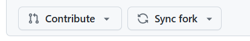
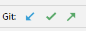
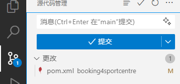
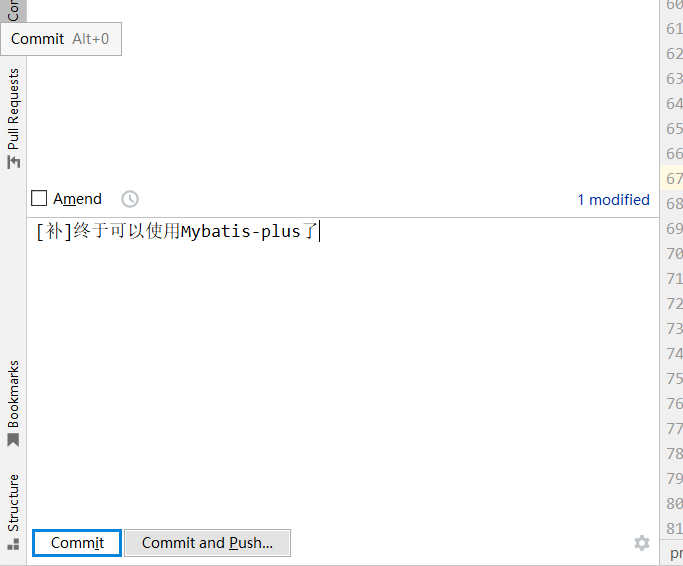
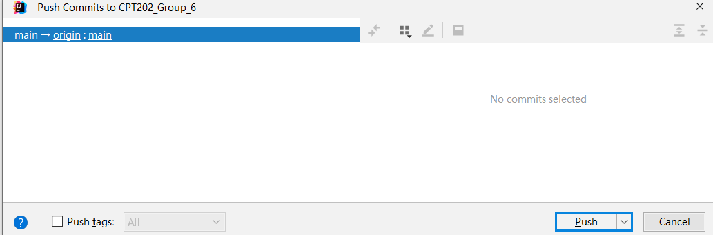
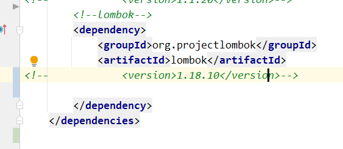
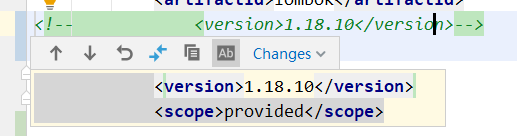

# CPT202_Group_6
XJTLU Year 3 Software Engineering Group Project CPT202 Project.

# Group Members:
* Ge Jinai
* Li Mingyuan
* Liu Chengze
* Wang Yixuan
* Wang Yue
* Xing Fuyu
* Zhang Baiyan
* Zhao Zhenyang
# Currenct Overview
原始骨架依据于视频“From PBI to Coding”，项目与视频进度同步到了1：00：25：model，repository，controller均已创建并通过Postman的GET测试代码及配置可行性：Request Status 200

# TODO
1. Fork项目的main branch到自己的repo，使用git或github desktop克隆到本地，再使用IDE打开克隆的文件夹
2. 本地测试代码是否可用（测试本地数据库，jdk等）：
   1. 先打开本地数据库（Mac与视频里一致，Win可在任务管理器的服务中找到MySql并启动）
   2. 同视频中创建新scheme：命名为sport_centre
   3. 在IDE中编辑环境变量：databasePassword:xxxx（以IDEA为例：顶部工具栏Run->edit configurations->Modify options->Environment variables->输入面的环境变量）
   4. 启动项目(查看控制台处是否返回类似“_Started Booking4sportcentreApplication in 2.735 seconds (process running for 3.179)_”)
   5. 使用postman或类似软件GET：http://localhost:8080/api/testMapper 如果返回200，控制台输出“查询成功！”代表配置成功

# Need to know
* application.properties中需要复制的Spring boot配置文件并未复制完，还差ppt中的后面4条
* 每次Git提交时不要把.idea或类似文件提交到仓库中，可以在提交commit时，右键文件夹选择Add to .git\info\exclude，或者在.gitignore中添加后清空git缓存再提交
* Swagger：http://localhost:8080/swagger-ui/index.html
* 已添加了Lombok插件（不需要写setter getter之类的）
* 已切换使用mybatis-plus（4.14）

# Git使用指南

## 基础须知

1. 每个人fork的项目都是同等地位，即应该只有一个最新版就是github这一版
2. 每个人fork的项目都是一个下游仓库，所以每个人写的代码（更新项目）都在下游发生
3. 当写完下游代码后，即可合并给上游（main），彻底完成本次代码的更新

## 常规流程：

1. 每次开发前确保当前要修改的branch与fork的branch完全一致：

   在自己的fork项目中，点击Sync fork即可将上游代码同步到自己的下游

   
2. 对fork的项目添加开发内容
3. 完成开发后，在ide中找到git commit按钮并点击。（图中的勾✔）

   

   

   commit时需要添加本次commit的描述：

   
4. commit后代码仍只是在本地修改，需要再push（或者在commit时点commit and push）

   

   此处的push即在修改GitHub上的代码，所以需要注意push的去向是正确的并再次检查本次push修改的代码是否正确
5. 我们的开发中，每次push只需要向自己fork的仓库push。因此当需要向main上游同步时，点击以下contribute：

   

   这会创建一个merge选项
6. 由于main branch有保护机制，所以每次merge都必须有一个除merge提交者以外的人检查后，才能准许本次merge（在GitHub上的Pull Request里）
7. 完成merge后一次完整的git流程结束

## 冲突需知

1. 情况1：

   假如在6：00，我Sync了main后进行开发，编辑了Test.java；另一个人在在6：15像main merge了他的代码，其中也编辑了Test.java。6：30我结束开发向main merge我的代码，会产生冲突，因为main的Test.java发生变化后，我并么有sync而且我对Test.java有修改

   解决方法：Github上会有冲突提示，需要协商后在Github上完成冲突解决
2. 情况2（可能在情况1发生后）：

   同以上例子：6：30我结束Test.java的开发，此时我将main Sync到本地，Github应该会提示有冲突，因此需要和别人协商后删除或修改代码解决冲突

## Git技巧

使用git后，文件更新会在代码左侧栏出现以下三种情况：

1. 灰色的三角箭头（或红色的箭头）：这里有删除
2. 蓝色的高亮：这行有修改
3. 绿色的高亮：这行是新增的

点击左侧高亮，即可展示具体修改了哪些东西，并可以详细对比或一键回撤

以上技巧也使用于每次push时的界面

